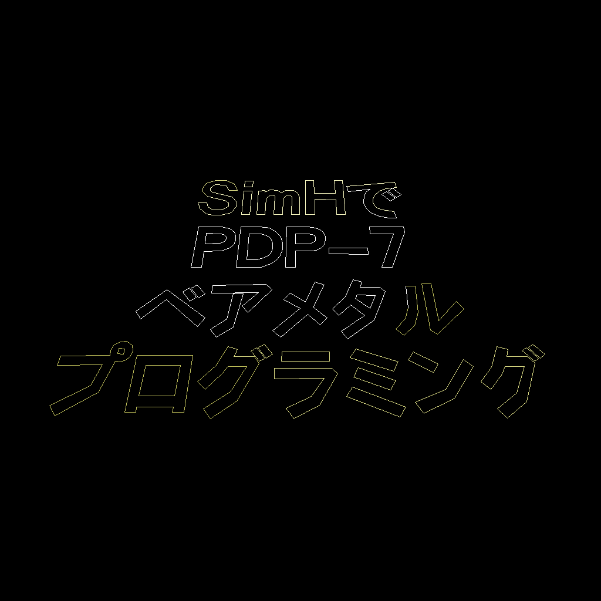

# SVGからそれを表示するsimhスクリプトを生成

SVG形式で保存された線の情報からType 340の命令列を生成するシェルスクリプトです。

そして、Type 340命令列を生成するだけでなく、それを描画するPDP-7命令まで生成し、最終的にsimhスクリプトができあがるようになっています。

## 注意事項

- LibreOffice Drawの「直線」あるいは「直線コネクター」で作った画像をエクスポートしたSVGを対象としています
  - 未確認ですがおそらくImpressでも大丈夫だと思います
  - 参考として、同人誌「SimHでPDP-7ベアメタルプログラミング」の表紙のType 340画面を生成する際に使用したLibreOffice Drawのファイル(`test.odg`)と、そこからエクスポートしたSVGファイル(`test.svg`)をこのリポジトリに含めています
- 幅と高さが同じ長さにしてください
  - 動作確認時は幅と高さを共に7.47cmにしていました
- このREADME.mdがあるディレクトリをカレントディレクトリにした状態で実行してください

## 生成手順

### Makeを使用する場合

使用するSVGファイルを`SRC`変数に指定して`make`を実行してください。

```console
$ make SRC=test.svg
```

実行が完了すると`SRC`に指定したファイル名の拡張子を`.simh`へ変更したファイル名(この例の場合`test.simh`)でsimhスクリプトが生成されています。

### 個別のシェルスクリプトを手動実行する場合

1. SVGから直線が定義されたCSVを生成
   ```console
   $ tools/svg2ld test.svg test.csv
   ```
2. CSVからType 340命令列を生成
   ```console
   $ tools/ld2ml test.csv test.340ml
   ```
3. Type 340命令列を指定されたアドレス(8進数)以降に配置するsimhスクリプトを生成
   ```console
   $ tools/ml2simh test.340ml test.340simh 1000
   ```
4. Type 340命令列をロードして実行するプログラムをくっつけたsimhスクリプトを生成
   ```console
   $ cat test.340simh type340/load_infexec_set_param_and_run.simh > test.simh
   ```

## 動作確認

生成されたtest.simhは以下のように実行できます。

```console
$ pdp7 test.simh
```

すると、ベクタースキャンディスプレイをシミュレートしている黒背景のウィンドウが開き、以下のように描画されます。



### 備考

- 実行を停止する際はCtrl+eで停止させてください
